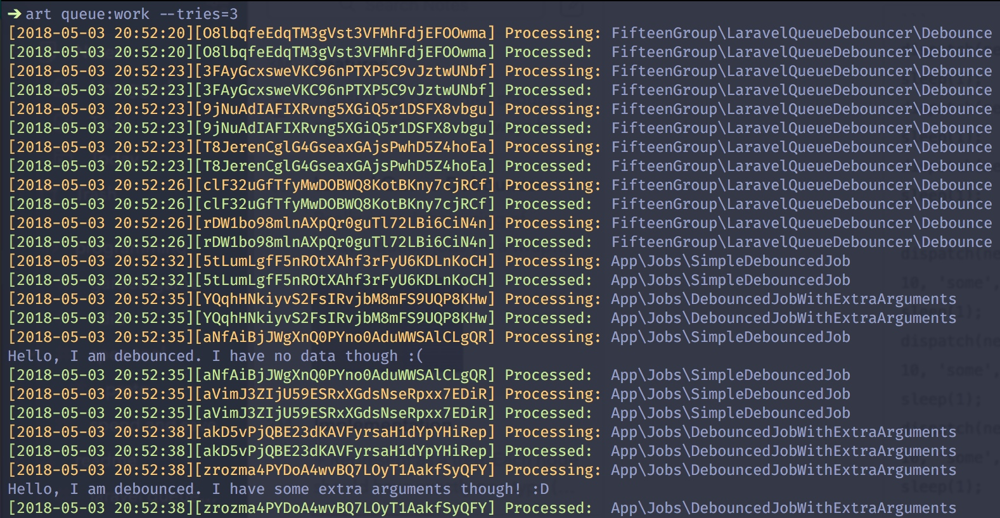

# Laravel Queue Debouncer
### Really easy debouncing of Laravel queue jobs via a wrapper job

## Requirements
* PHP >= 7.0
* Laravel >= 5.5
* A correctly configured asynchronous queue driver (tested with Redis and database drivers, but anything should work fine)
* A correctly configured cache driver

## Installation
`composer require mpbarlow/laravel-queue-debouncer`

## Usage
The package comes in two main parts: a wrapper job `Debounce` that is dispatched immediately, and an abstract superclass
`DebouncedJob` that your debounced jobs should extend.

`Debounce`’s constructor takes at least two arguments; `string $debounceable`, which is the fully-qualified class name of
the job you wish to debounce, and `int $waitTime`, which is the time in seconds that will be waited after the last dispatch of the job before it is fired. Any additional arguments will be passed directly to the constructor of the debounced job.
`Debounce` is also responsible for generating the unique ID that will be assigned to your job; out of the box it uses
[ramsey/uuid](https://github.com/ramsey/uuid), which ships with Laravel, to generate a random UUID4 string. However, if
this does not suit your needs, you can subclass `Debounced` and override `generateUniqueId()`.

If you would prefer to implement your own wrapper class, the interface `DebouncesJobs` contains the methods your
customer wrapper must implement and call from its `handle()` method. You are responsible for caching the unique ID in a
way that the debounced job can retreive, however the `ProvidesCacheKey` trait contains the default implementation used by
both `Debounce` and `DebouncedJob`.

`DebouncedJob` is the class that your debounced jobs should extend. It receives the unique ID from the
wrapper job via the constructor (if you need to override the default constructor be sure to call `parent::__construct($uniqueId)`
— `$uniqueId` is always the first argument your constructor receives, followed by any additional parameters you may have
passed). By default it takes responsibility for your job’s `handle()` method, checking whether the job should run, and
if so, calling the `debounced()` method. This is the method you should implement with your job logic. If the job should
not run, it is automatically deleted and `debounced()` is never called.

If you can’t subclass `DebouncedJob` for your jobs, this package also provides a trait `InteractsWithDebouncer`,
which provides the default implementation for `handle()`, and a method `shouldRun()` which returns a boolean value
indicating whether the job should run.

If you prefer or need to implement your logic in the normal `handle()` method (for example if you need access to objects
via dependency injection), override the provided implementation and call `shouldRun()` manually to determine your course
of action.

## Example
SimpleDebouncedJob.php
```php
...

public function debounced()
{
    echo "Hello, I am debounced. I have no data though :(\n";
}
```

DebouncedJobWithExtraArguments.php
```php
...

    protected $some;
    protected $extra;
    protected $arguments;

    public function __construct($uniqueId, $some, $extra, $arguments)
    {
        // We must make sure to provide the superclass constructor with the unique ID
        parent::__construct($uniqueId);

        $this->some = $some;
        $this->extra = $extra;
        $this->arguments = $arguments;
    }

    public function debounced()
    {
        echo "Hello, I am debounced. I have {$this->some} {$this->extra} {$this->arguments} though! :D\n";
    }

```

```php
dispatch(new Debounce(SimpleDebouncedJob::class, 10));
sleep(1);
dispatch(new Debounce(SimpleDebouncedJob::class, 10));
sleep(1);
dispatch(new Debounce(SimpleDebouncedJob::class, 10));
sleep(1);

dispatch(new Debounce(DebouncedJobWithExtraArguments::class, 10, 'some', 'extra', 'arguments'));
sleep(1);
dispatch(new Debounce(DebouncedJobWithExtraArguments::class, 10, 'some', 'extra', 'arguments'));
sleep(1);
dispatch(new Debounce(DebouncedJobWithExtraArguments::class, 10, 'some', 'extra', 'arguments'));
sleep(1);
```

`SimpleDebouncedJob` and `DebouncedJobWithExtraArguments` will each run approximately 10 seconds after their last dispatch,
respectively, producing the following output:



It's worth noting that if your job does not produce any output it may appear that it is running every single time. In a
sense it is, but only to determine whether or not execution should continue. The actual `debounced()` method containing
your logic is only executed when the bouncing has settled.

See also the included Examples folder.

## Potential Issues
Race conditions with certain drivers, particularly when multiple processes work the queue, or when wait times are very
short, can mean that the job that executes is not always the last one that was dispatched. It will still only execute
once, but it is important to bear this in mind if your job is strictly dependent on dispatch order.

## License
This package is open-source software provided under the [The MIT License](https://opensource.org/licenses/MIT).
